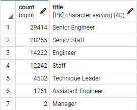

# Pewlett Hackard Analysis

## Overview of the Pewlett Hackard Analysis
The purpose of our project is to determine the number of retiring employees by title and identify which employees are eligible to participate in the mentorship program. Our retiring employee tables will show the titles of all employees born between January, 1 1952 and December, 31 1955. And our mentorship eligible employee table will show the titles of all employees born in 1965.

## Resources
- Data Source: departments.csv, dept_emp.csv, dept_manager.csv, employees.csv, retirement_info.csv, salaries.csv, titles.csv
- Software: PostgreSQL 14.0, pgAdmin 4 5.7

## Analysis Results
- With the retirment_titles table we are able to see every active employee who is eligible for retirement, what positions they have worked at Pewlett Hackard, and how long they have worked in each position.
- With the unique_titles table we simplify the previous retirement_titles table by showing all of the employees eligible for retirement, and their current position.
- With the retiring_titles table we are able to see the total number of each position that will be lost when the employees retire. It is important to notice here, that the majority of the retiring employees have senior titles.

- With the mentorship_eligibility table we are able to see the employee information, and the current position of all employees born in 1965. These employees should have enough experience, and would benefit the most from some mentorship, to take over the more senior roles from retiring employees.

## Summary
Based on the results, this is how I would address the following questions:

1) How many roles will need to be filled as the "silver tsunami" begins to make an impact?
90,398 roles (approximately 37% of the currently active workforce) are currently occupied by employees who fit our definition of retirement eligible. This means there will be many positions to fill over the next few years. 

2) Are there enough qualified, retirement-ready employees in the departments to mentor the next generation of Pewlett Hackard employees?
There are only 1,549 employees who fall under our definition of mentorship eligible. This means Pewlett Hackard will have a hard time filling all of the positions internally. It may be beneficial to locate some more high value employees to add to the mentorship program. And they should prepare for the process to hire qualified candidates externally.

